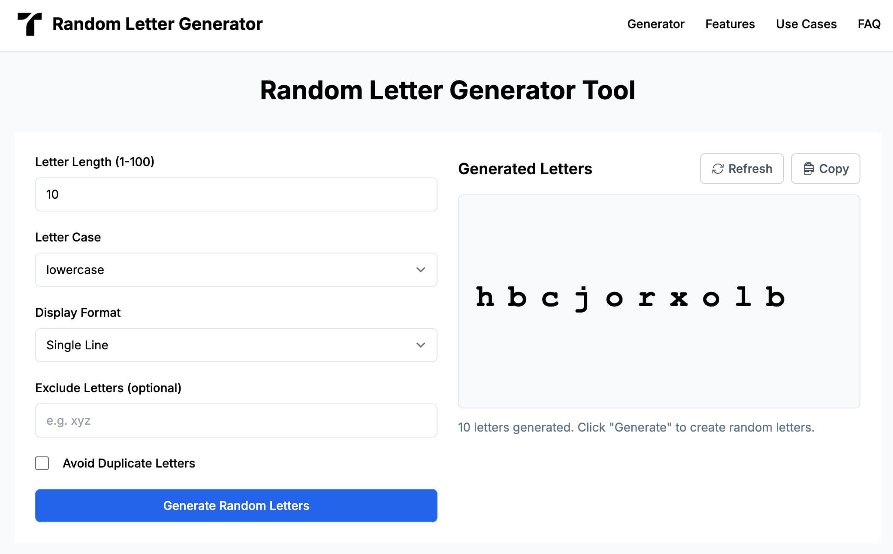

# Random Letter Generator

A free, customizable online tool to generate random letter sequences for creative writing, word games, education, and development projects.

🌐 **[Visit the live site: https://randomlettergenerator.online](https://randomlettergenerator.online)**

## Features

- **Customizable Letter Generation**: Choose length (1-100 letters), letter case (uppercase, lowercase, or mixed)
- **Multiple Display Formats**: View generated letters in single line, multiple lines, or grid format
- **Letter Exclusion**: Exclude specific letters from being generated
- **Duplicate Prevention**: Option to avoid duplicate letters in the generated sequence
- **One-Click Copy**: Easily copy the generated letters to clipboard with a single click
- **Instant Generation**: Get random letters instantly with no loading or refreshing
- **Mobile Friendly**: Works seamlessly on desktop, tablet, and mobile devices
- **Free & No Sign-up**: Completely free to use with no registration required

## Use Cases

- **Education & Teaching**: Create spelling exercises, vocabulary games, and alphabet learning activities
- **Games & Puzzles**: Design word games, puzzles, and word search challenges
- **Creative Writing**: Use for writing prompts, acrostic poems, and overcoming writer's block
- **Software Development**: Generate test data, unique identifiers, and placeholder content

## Setup & Installation

The Random Letter Generator is a static web application that requires no server-side processing.

## How It Works

The Random Letter Generator uses JavaScript to create random letter sequences based on user preferences:

1.        User sets their preferences (length, case, format, etc.)
2.        JavaScript generates random letters according to the specified parameters
3.        Results are displayed in the chosen format and can be copied with one click

## Browser Compatibility

The application works on all modern browsers including:
- Chrome
- Firefox
- Safari
- Edge

## License

This project is open source and available under the [MIT License](LICENSE).
